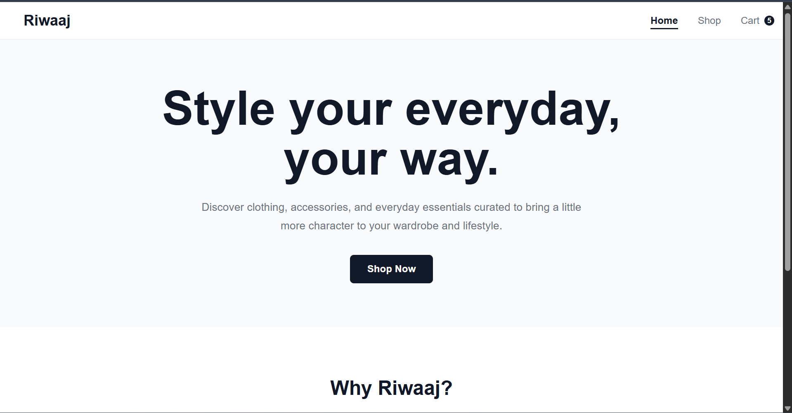
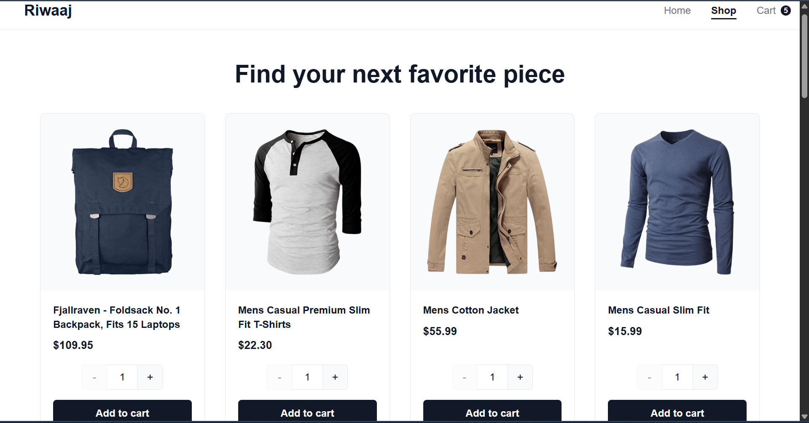
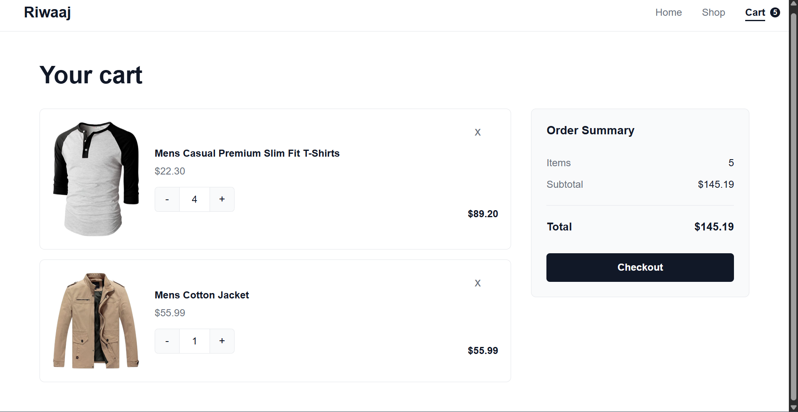
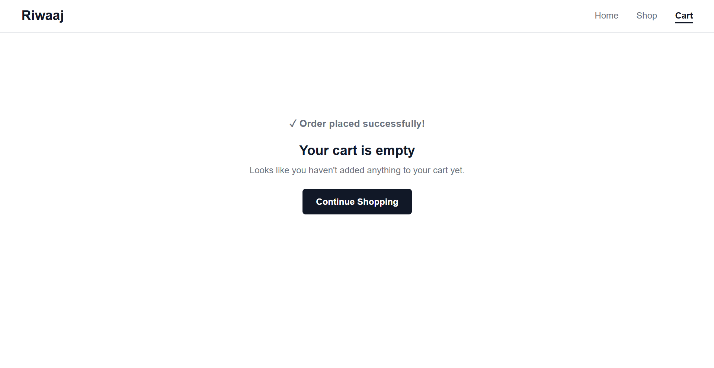

# Riwaaj

Riwaaj is a React-based e-commerce shopping cart application built around a simple goal: provide a clean and responsive shopping experience where users can browse products, manage their cart, and complete a mock checkout.

The application fetches product data from the FakeStore API and uses React Router for navigation between the home, shop, and cart pages.

## Live Demo

**Live:** To be updated after deployment.

## Screenshots






## Features

* Responsive home, shop, and cart pages
* Fetches product data from the FakeStore API
* Displays products in a responsive grid
* Allows users to select product quantities before adding them to the cart
* Increment and decrement controls for product quantities
* Manual quantity input with validation
* Visual feedback after adding a product to the cart
* Prevents duplicate cart entries by increasing the quantity of an existing product
* Displays the current number of items in the cart through the navigation bar
* Increase or decrease quantities directly from the cart
* Manual quantity updates from the cart
* Remove individual products from the cart
* Automatically calculates the number of items in the order
* Automatically calculates subtotal and total price
* Empty-cart state with a Continue Shopping option
* Mock checkout functionality
* Checkout success notification
* Responsive design for desktop, tablet, and mobile
* Loading state while fetching products data
* Error handling for failed API requests
* Interactive hover and focus states
* Keyboard-accessible interactive elements
* Component tests using Vitest and React Testing Library

## Built With

* React
* JavaScript (ES6 Modules)
* React Router
* CSS Modules
* Vite
* Vitest
* React Testing Library
* Testing Library User Event
* FakeStore API

## Shopping Flow

1. Browse products from the **Shop** page.
2. Select the desired quantity.
3. Click **Add to Cart**.
4. Continue shopping or open the cart.
5. Increase, decrease, or manually update product quantities.
6. Remove products when needed.
7. Review the order summary and total price.
8. Click **Checkout** to complete the mock order.
9. The cart is cleared and a success message is displayed.

## What I Learned

This project helped me practice and reinforce:

* Building reusable React components
* Structuring a multi-page React application
* Managing shared application state with `useState`
* Passing data and event handlers through props
* Sharing state between routes using React Router's `Outlet` context
* Working with nested routes
* Fetching and rendering external API data
* Handling asynchronous operations in React
* Managing controlled form inputs
* Validating user input
* Updating arrays and objects immutably
* Calculating derived values from application state
* Handling conditional rendering and different UI states
* Implementing user feedback for interactive actions
* Creating responsive layouts with CSS Grid and media queries
* Organizing styles with CSS Modules
* Writing component tests with Vitest
* Testing user interactions with React Testing Library
* Using accessible queries when testing UI
* Using ESLint to identify potential issues in React code
* Creating production builds with Vite

## Project Structure

```text
src/
├── components/
│   ├── CartItem.jsx
│   ├── Navbar.jsx
│   ├── ProductCard.jsx
│   └── ErrorPage.jsx
├── pages/
│   ├── Cart.jsx
│   ├── Home.jsx
│   └── Shop.jsx
├── styles/
│   ├── global.css
│   ├── Cart.module.css
│   ├── CartItem.module.css
│   ├── Home.module.css
│   ├── Navbar.module.css
│   ├── ProductCard.module.css
│   ├── Shop.module.css
│   └── ErrorPage.module.css
├── routes/
│   └── routes.jsx
├── App.jsx
└── main.jsx

tests/
├── Cart.test.jsx
├── CartItem.test.jsx
└── ProductCard.test.jsx
```

## Installation

Clone the repository:

```bash
git clone https://github.com/abdullahrashid359/shopping-cart.git
```

Navigate to the project directory:

```bash
cd shopping-cart
```

Install dependencies:

```bash
npm install
```

Start the development server:

```bash
npm run dev
```

Create a production build:

```bash
npm run build
```

## Testing

The project includes component tests for the main shopping cart functionality.

Tests cover:

* Product card rendering
* Product quantity controls
* Adding products to the cart
* Cart item rendering
* Increasing and decreasing cart quantities
* Updating quantities through the input
* Removing cart items
* Cart item count calculations
* Cart total calculations
* Empty-cart state
* Checkout behavior
* Checkout success feedback

Run the test suite:

```bash
npm test
```

Run the tests once without watch mode:

```bash
npm test -- --run
```

Run ESLint:

```bash
npm run lint
```

Create a production build:

```bash
npm run build
```

## API

Product data is provided by the **FakeStore API**.

https://fakestoreapi.com/

The application fetches product data from the API and renders the available products on the Shop page.

## Acknowledgements

This project was completed as part of **The Odin Project** React course in the Full Stack JavaScript Path.

https://www.theodinproject.com/lessons/node-path-react-new-shopping-cart